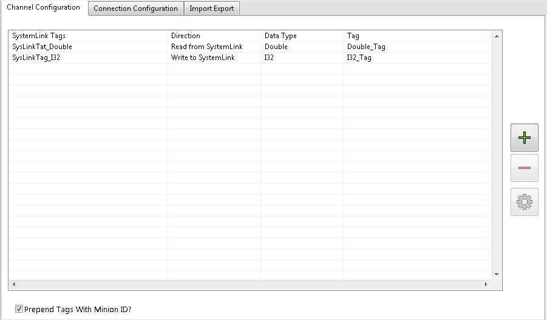
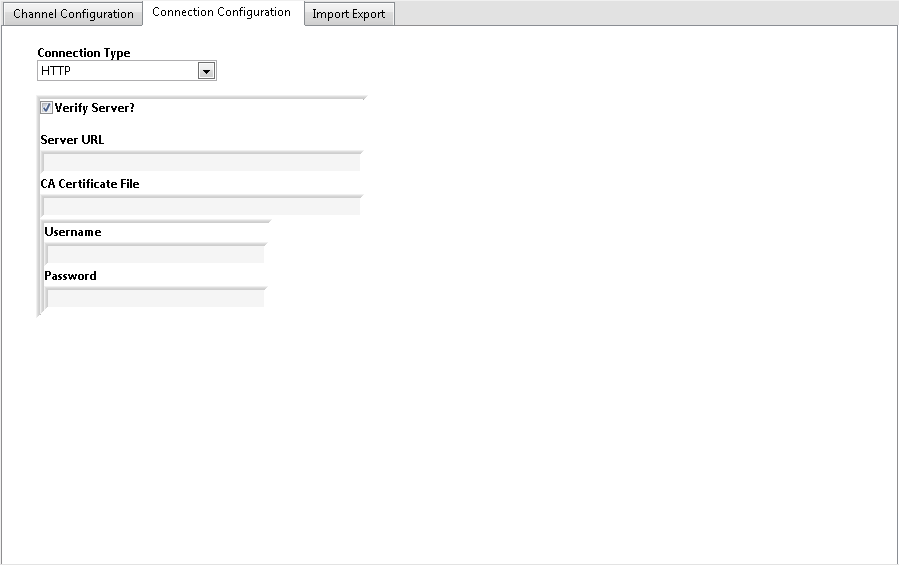
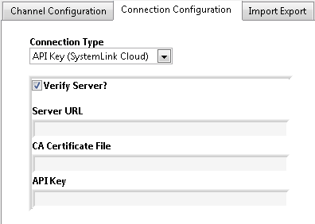
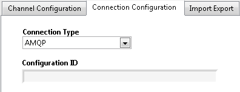
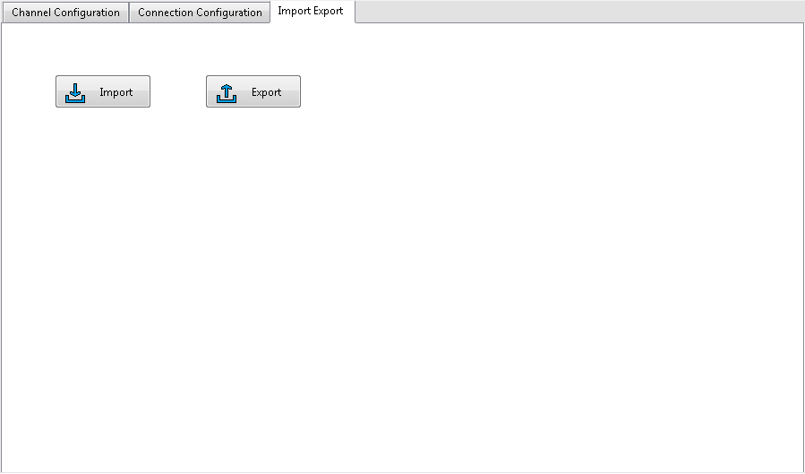

# Overview

Read or write tag data to and from a configured [SystemLink](http://www.ni.com/product-documentation/54037/en/) Server.

# Configuration

### Channel Configuration

**SystemLink Tags:** Path to the SystemLink tag. If the tag does not already exist, it will be create during initialization.

**Direction:** Select whether the tag is being written to or read from the SystemLink Server.

**Data Type:** The data type of the configured channel. SystemLink directly supports only a subset of all DCAF data types so the selected data type will correspond to data types within the SystemLink server as follows.

Selected Data Type | SystemLink Data Type
--- | ---
Double, Single | Double
U64, U32, U16, U8 | U64
I32, I16, I8 | I32
Boolean | Boolean
String | String
Timestamp | Timestamp

> **Note:** All tags will be stored in the Tag Bus as the selected data type except for `Timestamp` which is stored in the Tag Bus as a double.

**Tag:** The DCAF tag which the SystemLink channel will be mapped to.

### Connection Configuration

**Connection Type:**
+ **HTTP -** Enables  you to specify the server URL, username, and password to initiate a connection with a SystemLink server through your authenticated credentials.
+ **API Key (SystemLink Cloud) -** Enables you to specify the server URL and an API key to initiate connection to the SystemLink Cloud server.
+ **AMQP -** Enables you to specify the Configuration ID of the server to initiate a connection to the server over AMQP.

**Verify Server?:** Specifies whether to verify the server's identity and establish a secure connection. The default is TRUE.

**Server URL:** The URL of the server hosting the SystemLink tags. The Server URL should use the format `scheme://host:port`. If not specified, the default scheme is http and the default port is 80.

**CA Certificate File:** The path to a list of trusted certificate authority (CA) certificates. If **Verify Server?** is TRUE, the client verifies the server's identity against this list of trusted certificates.

**Username:** The log-in username for the server configured

**Password:** The password associated with the configured username.

**API Key:** A string key which authenticates the client for SystemLink Cloud. API Keys can be generated by navigating to [systemlinkcloud.com/security](https://www.systemlinkcloud.com/security) and clicking `+ New API Key`.

**Configuration ID:** If left blank, the machine will first attempt to establish communication to the server specified in the SystemLink Client GUI. If the machine is not configured to connect to a SystemLink server, or if the server is unreachable, the client will attempt to connect to the local server.

For more information on specifying a configuration ID, review he document located at `<ProgramData>\National Instruments\Skyline\SkylineConfigurations\readme.txt`.

### Import Export

**Import:** Imports channel configuration table from CSV file.

**Export:** Exports channel configuration table to CSV file.

### Software Requirements

+ LabVIEW 2015 or later
